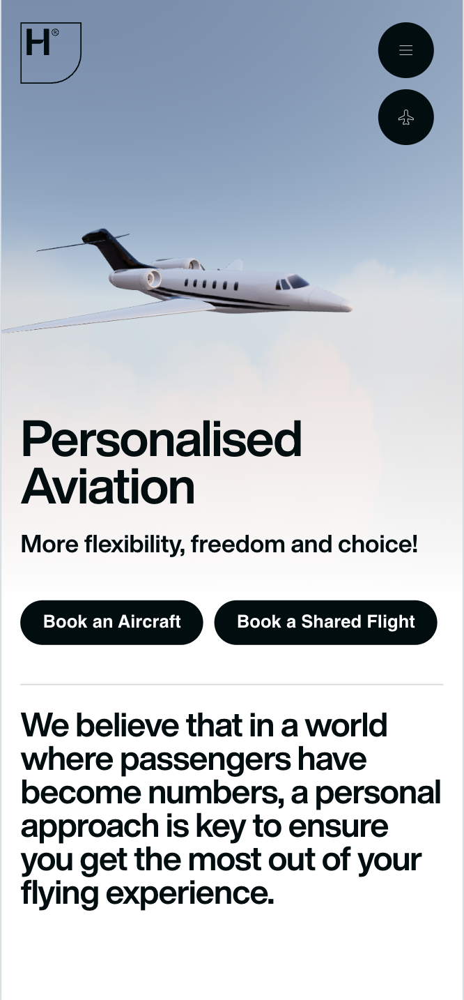
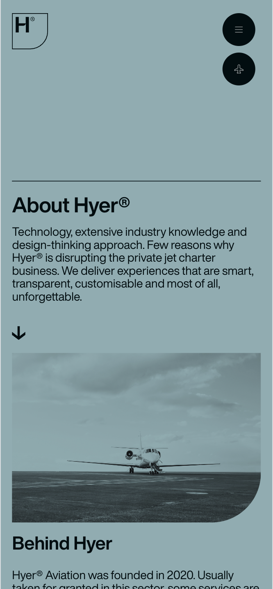
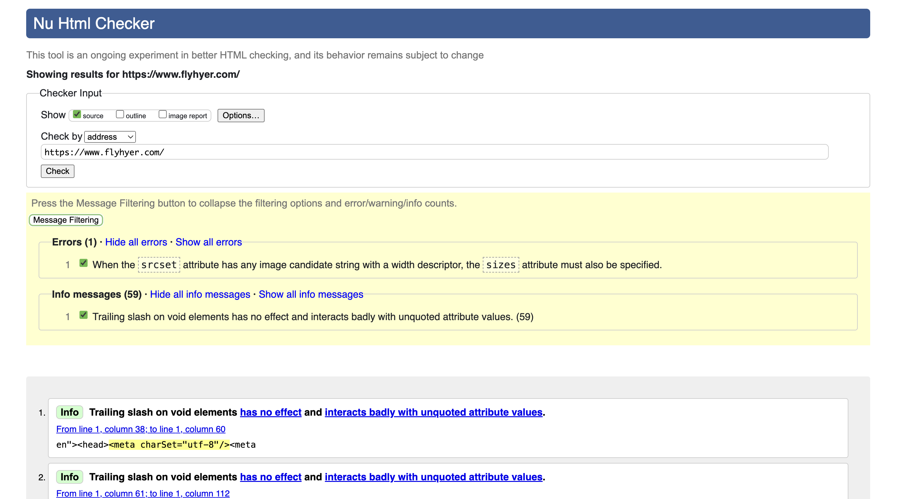
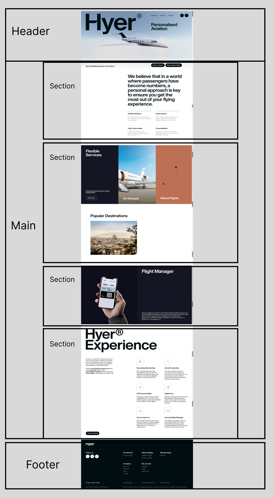
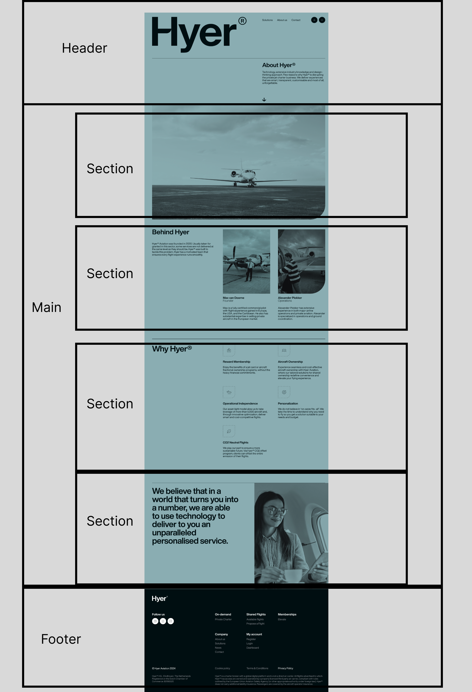
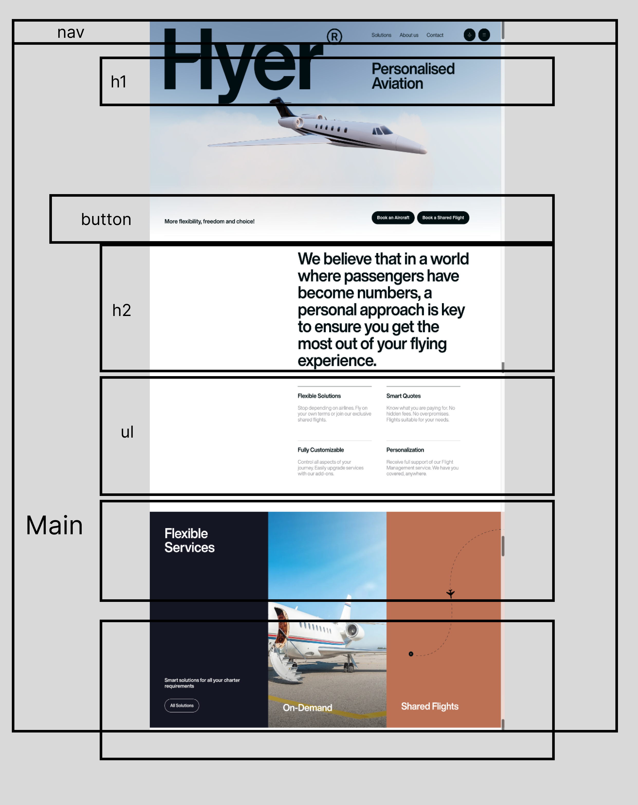
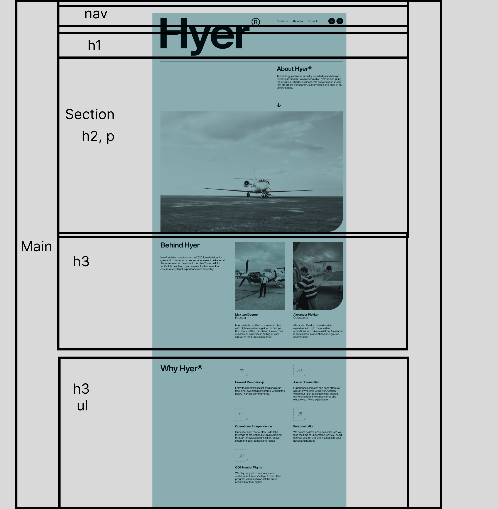
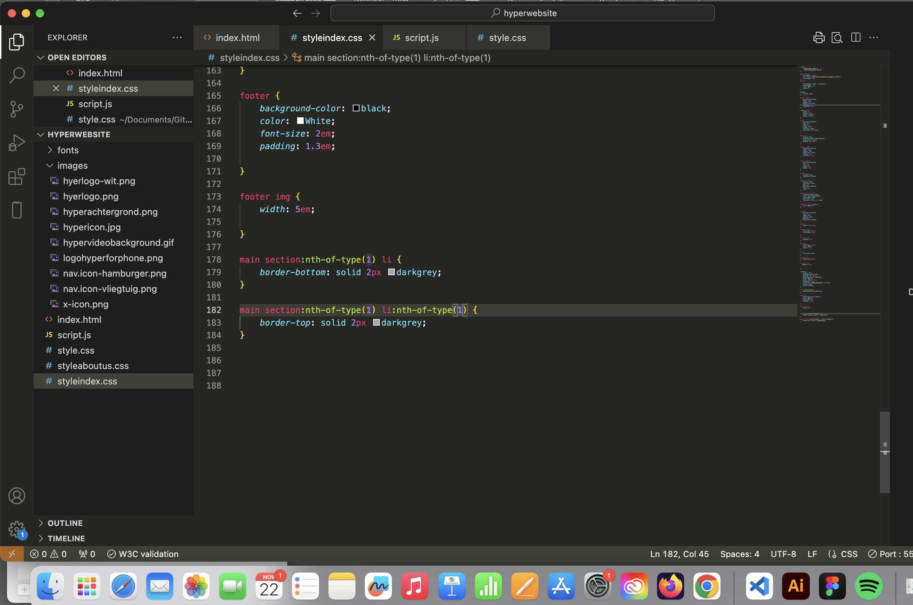
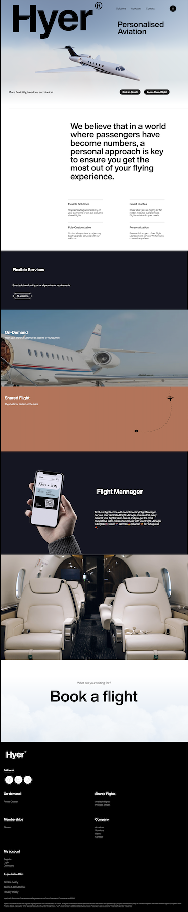
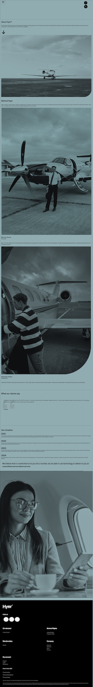

# Procesverslag
Markdown is een simpele manier om HTML te schrijven.  
Markdown cheat cheet: [Hulp bij het schrijven van Markdown](https://github.com/adam-p/markdown-here/wiki/Markdown-Cheatsheet).

Nb. De standaardstructuur en de spartaanse opmaak van de README.md zijn helemaal prima. Het gaat om de inhoud van je procesverslag. Besteedt de tijd voor pracht en praal aan je website.

Nb. Door *open* toe te voegen aan een *details* element kun je deze standaard open zetten. Fijn om dat steeds voor de relevante stuk(ken) te doen.

## Jij

  
uitwerken voor kick-off werkgroep

  ### Auteur:
  Ivy Vo 

  #### Je startniveau:
  *rood* 

  #### Je focus:
  *helemaal responsive*
 

## Je website

  
uitwerken voor kick-off werkgroep

  ### Je opdracht:
 https://www.flyhyer.com/
  link naar de website die je gaat namaken óf de naam/omschrijving van je eigen ontwerp

  #### Screenshot(s) van de eerste pagina (small screen): 
  Home pagina
  

  #### Screenshot(s) van de tweede pagina (small screen):
  Over ons pagina
  
 

## Toegankelijkheidstest 1/2 (week 1)

  
uitwerken na test in 2e werkgroep

  ### Bevindingen
  Lijst met je bevindingen die in de test naar voren kwamen:
   

  1 error voor -> When the srcset attribute has any image candidate string with a width descriptor, the sizes attribute must also be specified. 
   
   1 error voor -> Element figcaption not allowed as child of element blockquote in this context. Suppressing further errors from this subtree.

  - Geen header 
  - Geen darkmode
  - Ze hebben alle headings, begon met H1
  - Alt tekst duidelijk, worden gelezen door screenreader.

   

## Breakdownschets (week 1)

  
uitwerken na afloop 3e werkgroep

  ### de hele pagina: 
  
    

  ### dynamisch deel (bijv menu): 
  
   

## Voortgang 1 (week 2)

  
uitwerken voor 1e voortgang

  ### Stand van zaken
  hier dit ging goed & dit was lastig (neem ook screenshots op van delen van je website en code)

   
  

  ### Agenda voor meeting
  samen met je groepje opstellen

  | student Ivy     | student Helina      | student Milo   
  | ---             | ---                     | --- 
   fontface, bottom  fontface, nav             a in ul, hidden h1 in section
  line, html 
  ordernen
                

  ### Verslag van meeting
  hier na afloop snel de uitkomsten van de meeting vastleggen

  - html eerst goed in order hebben
  - kijken naar welke headings 
  - alt tekst en sections met hidden heading 
  - ...

## Voortgang 2 (week 3)

  
uitwerken voor 2e voortgang

  ### Stand van zaken
  hier dit ging goed & dit was lastig (neem ook screenshots op van delen van je website en code)

  ### Agenda voor meeting
  samen met je groepje opstellen

  | studentIvy            
  | ---           
  | tekst met  position relative 
  | om op foto te  zetten 
  | als ert tijd is
   wil ik mijn font 
  wanneer die online
  is op github 
  staat fixen.   
  | als er meer tijd is wil ik light dark kunnen oplossen in mijn code die error geven.

  
  | student Helina          
  | ---           
  | form van footer,
  | losje foto knippen ipv hele foto van icons
  | als ert tijd is.
  | als er meer tijd is wil ze light dark kunnen oplossen in haar code die error geven.

  | student Milo          
  | ---           
  | Ziek
  | 
  | 
  

               

  ### Verslag van meeting
  hier na afloop snel de uitkomsten van de meeting vastleggen

  - Fontface op github
  - Losje foto
  - Lightdark color cheme
- ...

## Toegankelijkheidstest 2/2 (week 4)

  
uitwerken na test in 9e werkgroep

  ### Bevindingen
  Lijst met je bevindingen die in de test naar voren kwamen (geef ook aan wat er verbeterd is):

## Voortgang 3 (week 4)

  
uitwerken voor 3e voortgang

  ### Stand van zaken
  font face werkte eerst niet op github, animatie op de achtergrond beweegt past nadat de header is voorbij. @media vond ik nog lastig ik wist niet wanner ik min-width en max width moet gebruiken. 

  ### Agenda voor meeting
  samen met je groepje opstellen

  | Ivy (ik had alleen met Sanne Voortgang gesprek 3)     
  | Ik wist hoe fontface kan aanspreken in mijn css en vanuit de font folder, ik wist @media werkt en grid|

  ### Verslag van meeting
  hier na afloop snel de uitkomsten van de meeting vastleggen

  - grid voor verschillende tekstblokken en kolomen 
  - fontface
  - @media
  -

## Eindgesprek (week 5)

  
uitwerken voor eindgesprek

  ### Je uitkomst - karakteristiek screenshots:
  
   

  ### Dit ging goed/Heb ik geleerd: 

    
    In het begin gebruikte ik CSS Grid zonder goed te begrijpen wanneer het echt nuttig was. Soms gebruikte ik Grid voor simpele layouts waar `flexbox` efficiënter zou zijn geweest. Ik heb geleerd om Grid te gebruiken wanneer ik complexe, meerlagige layouts nodig heb, zoals meerdere kolommen en rijen (zoals in mijn voorbeeld met 2 kolommen en 4 tekstblokken). Voor eenvoudige alignments of een enkele rij gebruik ik nu vaker `flexbox`.
    

- **Lettertypes op een live website:**
    
    Mijn lettertypes werden niet geladen toen ik mijn website hostte op GitHub Pages, omdat ik een verkeerde padstructuur had gebruikt voor mijn fonts. Ik heb geleerd om ervoor te zorgen dat mijn lokale bestanden correct worden gehost en gelinkt. Bij hosting op GitHub Pages moet je letten op het pad naar je bestanden. Absolute paden (`/`) werken soms niet goed; het is beter om relative paden (`./`) te gebruiken.
    
- **Responsiviteit verbeteren:** Mijn eerste designs zagen er goed uit op desktop, en kleine schermen. Ik heb geleerd om `@media` queries in CSS te gebruiken om mijn layout aan te passen voor verschillende schermformaten. Ik test nu mijn designs op verschillende schermgroottes (desktop, tablet, mobiel).

        Een responsive design is essentieel. Ik gebruik nu tools zoals Chrome DevTools om te testen hoe mijn website eruitziet op verschillende apparaten en bouw mijn layout "mobile-first".
  

  ### Dit was lastig/Is niet gelukt:
  - **Dark/Light Mode:**
    - **Probleem:** Mijn dark/light mode werkte niet goed omdat ik een kleine typfout had gemaakt (zoals een spatie extra in mijn CSS variabelen).  Debuggen van kleine foutjes kan frustrerend zijn, maar het leert me mijn code beter organiseren en nauwkeuriger werken. 

  

## Bronnenlijst

  
continu bijhouden terwijl je werkt

  Nb. Wees specifiek ('css-tricks' als bron is bijv. niet specifiek genoeg). 
  Nb. ChatGpT en andere AI horen er ook bij.
  Nb. Vermeld de bronnen ook in je code.

<!-- /bronvermelding:
 scroll driven: https://scroll-driven-animations.style/
 nav bar: https://codepen.io/ivyv0/pen/YzmodBo
 fonts: https://www.onlinewebfonts.com/download/04e6981992c0e2e7642af2074ebe3901
 fade in: https://www.geeksforgeeks.org/how-to-create-fade-in-effect-on-page-load-using-css/
 slide: https://stackoverflow.com/questions/60235253/how-to-get-a-list-of-google-slide-title-and-slide-number-google-apps-script
  -->

